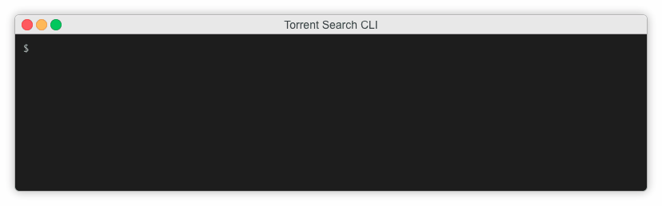

# Torrent Search CLI

A tool that lets you find torrents without leaving your CLI.



## Usage

Clone this repo `git clone git@github.com:Ebonsignori/torrent-search-cli.git`

Navigate to the root directory and install dependencies with `npm install`

Start the CLI tool with `npm start` or as an executable with `./cli.js`

Run `./cli.js -h or npm start -- -h` to see the CLI options


## Example

The command  showed in the gif above lists up to **35** results from the **1337x** provider. Instead of opening the magnet url by default (via `-o=false`), the command copies the magnet url of the torrent you select to your clipboard (via `--clipboard`).


Give it a try,
```bash
./cli.js ubuntu -p='1337x' -o=false  --rows=35 --clipboard
```

## TODO

- Add default configs in home directory that can be edited with the following command `./cli.js config <option> <value>`
- Use **node-torrent** or similar lib to actually download torrents
