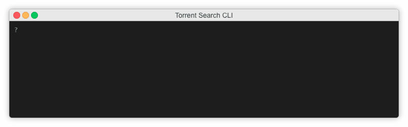
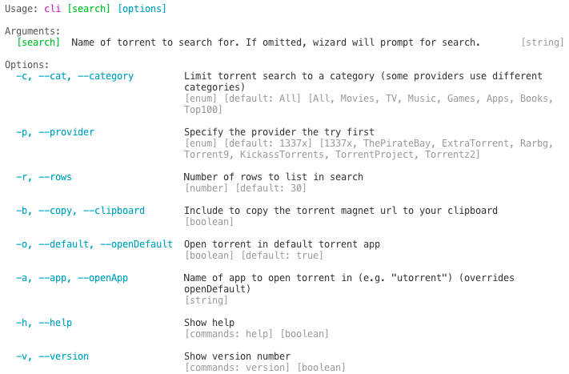

# Torrent Search CLI

A tool that lets you find torrents without leaving your CLI.



## Usage

Clone this repo `git clone git@github.com:Ebonsignori/torrent-search-cli.git`

Navigate to the root directory and install dependencies with `npm install`

Start the CLI tool with `npm start` or as an executable with `./cli.js`

Run `./cli.js -h or npm start -- -h` toe see the CLI options



## Example

The command  showed in the gif above lists 35 results from the `1337x` provider. Select an item from the list to copy your selection's magnet url to your clipboard.

Give it a try,
```bash
./cli.js ubuntu -p='1337x' -o=false  --rows=35 --clipboard
```
